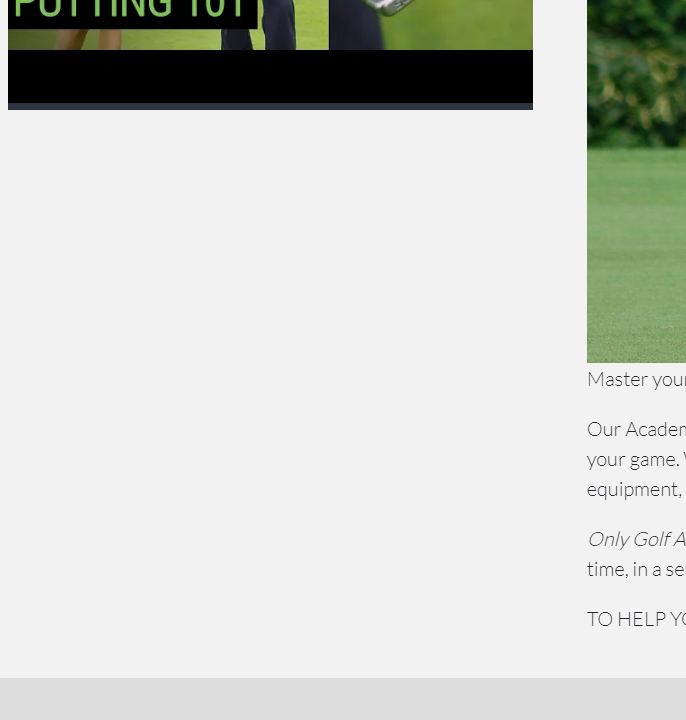
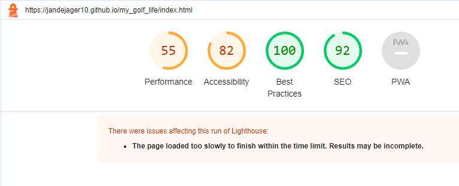

# my_golf_life
 p4_milestone_project_1

# Welcome
Welcome to my "Level 5 Diploma in Web Application Development" Milestone Project 1.
At the time of writing this I have only a vague idea of what I want this project to be about and very little time to spend on it as well - Let that be the end of the excuses.

# Goal
	# External user’s goal:
		The site's users are amateur and professional golfers, looking for golf courses to play at, kit and equipment to buy.

	# Site owner's goal:
		The site is interested in selling a lot of kit and equipment.

	# Potential features to include:
		Allow for trade-in of older equipment for resale.

		Assist with booking and travel arrangements.

		Assist with training guides and/or rainers for young and old.

# Software installed and used
- 	VS Code
		- Live Preview Extension
		- GitHub Pull Requests and Issues Extension
- 	Github Desktop
- 	git 
- 	Balsamiq Wireframes (not used - yet)
- 	Notepad++
	
# Wireframes
-	no wireframes done for this project yet.
- would have helped with whitespace like this 

# Reminders
- keep track next time

# Acknowledgements + Code
- 	Code for hover transitions from http://ianlunn.co.uk/ using cdnjs cloudflare shortcuts.
- 	Code for Bootstrap CSS framework delivered via https://cdn.jsdelivr.net
- 	Code for FontAwesome delivered via https://cdn.jsdelivr.net
- 	style.css basic layout headings from codeinstitute.com, the Rosie mini-project.
-	Adobe, for the color wheel.  #2D3540	#0B8C38	#20733D #5DBF4E #F2F2F2
-	Pictures / Photos from https://pixabay.com/
-	Picures / Photos from https://www.shutterstock.com/
	
# Content
	This includes history and information.
		

# Media (images and animations)
	All them pictures have got to come from somewhere afterall:
-	Pictures / Photos from https://pixabay.com/
-	Picures / Photos from https://www.shutterstock.com/
		no individual attribution at this stage.
	
# Release History + Bugs
22/01/2024 - Deleted basically everthing that came before and restarted - really hope this goes well as there is not much time left.
30/01/2024 - So little time and nothing works yet - picture flex is biggest problem at the moment.

# TESTING
-	Too many pages
		Cut down to minimum as required (3)
-	Ideas are not comming togetehr and usrr story is not working.
-	Pictures are not flexing (biggest Problem)

-Fix - Resizing of image on error.html now ok
		- Outstanding is text does not stay centered.

- Initail Page load with Lighthouse - Performance - Really Bad

- Best Practices weirdly really good - must have learnt something at least.
- Convert vector images from .jpg to .WebP
	- got new image and back ro .png
- srcset and sizes values for your images
- images resized - now failing when published bit working in vs_code
- Validation of HTML shows 4 errors - keeping it as is with errors
- misnamed image files causing LCP delays in lighthouse

# FAQ
-	Not FAQ yet -basic clicks only.
-	Video are set to paused
-	Videos are set sound "on"
